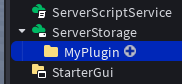

# Beginner Plugin Creation Guide

This guide will walk you through with everything you need to know to create your first plugin!
Follow the steps below, to make your first ever plugin:

## 1. Basic Setup:-

We will start by first setting up the basics for our plugin.

### 1.1

Add a Folder inside ServerStorage and name it whatever you want your plugin to be named. Here, we use `MyPlugin`

